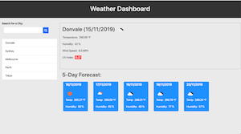

# Weather Dashboard

This project is deployed [here](https://cynwong.github.io/Weather_Dashboard/).

## Description

Weather Dashboard is an one-page application where the user can search for weather by city name e.g. "Clayton", "Melbourne".

Weather Dashboard display current weather information and next five days forecasts.

## User Story

```
    As a traveler
    I want to see the weather outlook for multiple cities
    so that I can plan a trip accordingly
```

## Screen Shots



## Instructions

Upon opening weather dashboard, weather dashboard will ask permission to use geo-location service. If allowed, weather dashboard will show current location's weather. If not allowed, weather dashboard will show weather information of last searched city.

### 1. Search a city's weather

To search for weather of a city, type the name of the city in the search box and click search button.

### 2. Save a city to Favourite searches

To save a city to Favourite,
    1. Click and drag the city name in weather information.
    2. Drag the name to left panel under search box.
    3. Drop the name onto the Favourite list.

### 3. Remove a city from Favourite

To remove a city from Favourite,
    1. When you move your cursor onto the city name, minus button "-" will show on the right of the city name.
    2. Click on the minus button to remove the city.

Favourites are stored in LocalStorage/Browser. So, the user will be able to assess it next time they open weather dashboard.

## References

UV Index are colour coded as per [Bureau of Meteorology](http://www.bom.gov.au/uv/about_uv_index.shtml)(BOM)'s standard.

## Technologies used

* HTML5
* CSS
* Bootstrap
* Font-awesome
* Vanilla JavaScript
* jQuery including its AJAX and Promise
* OpenWeatherMap API
* LocalStorage
